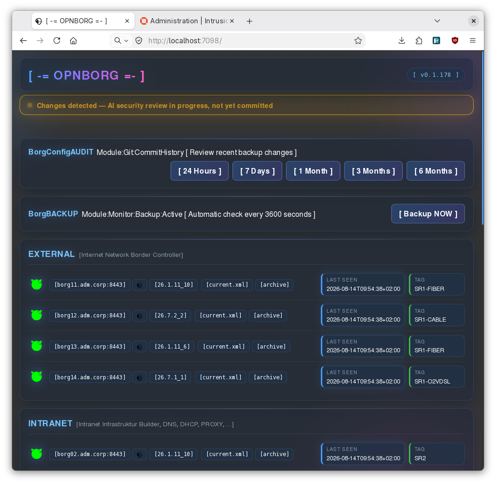
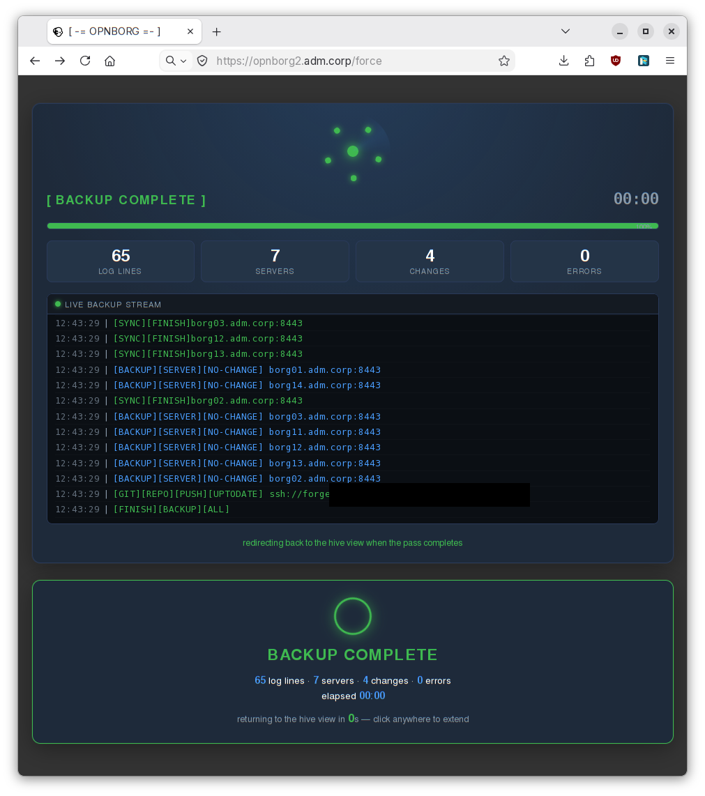

<div align="center">

# ⚙️ OPNBORG

### Resistance is futile. Your OPNsense will be assimilated.

A self-hosted, single-binary daemon that **backs up, monitors, and synchronizes configuration** across a fleet of [OPNsense](https://opnsense.org/) firewalls and (optionally) [Unifi](https://ui.com) controllers — with an embedded WebUI, central syslog collector, and a consolidated git-tracked archive for rapid restore.

[](https://pkg.go.dev/paepcke.de/opnborg)
[](https://goreportcard.com/report/paepcke.de/opnborg)
[](https://github.com/paepckehh/opnborg/actions/workflows/golang.yml)
[](https://github.com/paepckehh/opnborg/blob/master/LICENSE)
[](https://github.com/paepckehh/opnborg/releases/latest)
 
... 

[](https://search.nixos.org/packages?channel=unstable&from=0&size=50&sort=relevance&type=packages&query=opnborg)

[paepcke.de/opnborg](https://paepcke.de/opnborg/) · [Releases](https://github.com/paepckehh/opnborg/releases) · [Docs](https://pkg.go.dev/paepcke.de/opnborg) · [Issues](https://github.com/paepckehh/opnborg/issues)

</div>

---

## 📸 WebUI - ShowTime





---

## ✨ Features

- **Central Monitoring** — version, status, online/offline, last seen, configuration compliance across the whole hive.
- **Central Package Management** — replicate installed OPNsense plugins from one master host to every target.
- **Central Configuration Audit & Backup** — a consolidated git repo plus a filesystem archive for auditable change-log trails and rapid restore.
- **Central Log Consolidation** — built-in RFC5424 syslog collector with rotation and archiving.
- **Unifi Controller Backup** — download and archive Unifi controller `.unf` backups, mirror a co-located autoBackup folder, and export the Unifi inventory to CSV/JSON.
- **Backup Dashboard** — the WebUI renders a bottom-of-page `BorgDASHBOARD` panel showing the on-disk backup store stats (servers, archive count, total size, newest archive), the local git repo state (HEAD, commit count, last commit, dirty worktree), and the upstream sync health (in sync / ahead / behind / diverged / never pushed, last push result) — all gathered from local state with no network round-trip on render.
- **Single Static Binary** — no runtime dependencies; cross OS & hardware via Go (Linux, FreeBSD, OpenBSD, NetBSD, Windows; amd64, arm64, armv7).
- **NixOS Integration** — ready-made modules for Prometheus + Grafana (WIP: Wazuh, Influx, Graylog).
- **Complementary Sidekick** — designed as a small companion to [OPNCentral](https://opnsense.org/), not a replacement.
- **Free & Open Source** — BSD 3-Clause. Contributions and forks welcome.

---

## 🚀 Quick Start

Run the latest tagged release directly from source — no build step required:

```sh
OPN_PATH='/tmp/opn' \
OPN_TARGETS='opn01.lan:8443,opn02.lan:8443' \
OPN_APIKEY='...' \
OPN_APISECRET='...' \
go run paepcke.de/opnborg/cmd/opnborg@main
```

In daemon mode (the default) the internal WebUI comes up at
<http://localhost:6464>. Add `OPN_NODAEMON=1` to run a single backup pass and
exit instead. See the [Minimal example](#minimal-example) below for a copy &
paste baseline, and the [Unifi controller backup](#unifi-controller-backup)
section when you want to back up a Unifi controller instead of (or alongside)
OPNsense.

---

## 📦 Installation

### Pre-built binaries

Download the latest release for your platform from the
[Releases page](https://github.com/paepckehh/opnborg/releases).

### From source

```sh
go install paepcke.de/opnborg/cmd/opnborg@main
```

### Docker

```sh
docker pull ghcr.io/paepckehh/opnborg:latest
```

### NixOS / Nix

Available as a Nix package — see [search.nixos.org](https://search.nixos.org/packages?channel=unstable&from=0&size=50&sort=relevance&type=packages&query=opnborg).
Ready-made service modules live in this repo:

- `opnborg-docker.nix`
- `opnborg-docker-complex.nix`
- `opnborg-prometheus-grafana.nix`

---

## 🔧 Configuration

OPNBORG is configured entirely through **environment variables** — the binary itself accepts only `-v` / `-h`. A local `.env` file in the working directory is auto-loaded via `godotenv` if present.

> ⚠️ **Booleans are presence-based.** Setting `OPN_DEBUG=0`, `OPN_DEBUG=false`, or `OPN_DEBUG=1` all evaluate to **true**. To disable a flag, **unset** the variable. The only exception is the empty string, which is treated as false. `OPN_NODAEMON` inverts the default (daemon mode is on when unset). The git repo feature is **opt-in** via `OPN_GIT_ENABLE` (unset = off).

Example configurations are provided in the repo root:

| File | Use case |
| --- | --- |
| `example.sh` | Minimal baseline |
| `example-env-config-simple.sh` | Small OPNsense fleet |
| `example-env-config-complex.sh` | Multi-group hive |
| `example-env-config-dev.sh` | Development / debug |
| `example-env-config-unifi.sh` | Unifi controller |

### Minimal example

```sh
export OPN_PATH='/tmp/opn'
export OPN_TARGETS='opn01.lan:8443,opn02.lan:8443,opn03.lan:8443'
export OPN_APIKEY='+RIb6YWNdcDWMMM7W5ZYDkUvP4qx6e1r7e/Lg/Uh3aBH+veuWfKc7UvEELH/lajWtNxkOaOPjWR8uMcD'
export OPN_APISECRET='8VbjM3HKKqQW2ozOe5PTicMXOBVi9jZTSPCGfGrHp8rW6m+TeTxHyZyAI1GjERbuzjmz6jK/usMCWR/p'
```

### Custom groups with descriptions & images

Split the hive into named groups via `OPN_TARGETS_<GROUP>`. Each group may carry an optional WebUI text description (`OPN_TARGETS_DESC_<GROUP>`) and an optional image URL (`OPN_TARGETS_IMGURL_<GROUP>`) that replaces the text headline — when an image is set, the description becomes the image's tooltip.

```sh
export OPN_TARGETS_STANDBY='opn00.lan:8443#RACK-LAB-2ND-FLOOR'
export OPN_TARGETS_INTRANET='opn01.lan:8443#RACK-PROD01,opn02.lan:8443#RACK-PROD02'
export OPN_TARGETS_EXTERNAL='opn03.lan:8443#RACK-DMZ01-VODAFONE,opn04.lan:8443#RACK-DMZ02-TELEKOM'

export OPN_TARGETS_DESC_STANDBY='Hot-Standby'
export OPN_TARGETS_DESC_INTRANET='Intranet Builder'
export OPN_TARGETS_DESC_EXTERNAL='External Internet Gateways'

# or alternative, some (custom) images (go wild ...) instead of text 

export OPN_TARGETS_IMGURL_STANDBY='https://paepcke.de/res/hot.png'
export OPN_TARGETS_IMGURL_INTRANET='https://paepcke.de/res/int.png'
export OPN_TARGETS_IMGURL_EXTERNAL='https://paepcke.de/res/ext.png'
```

The Unifi backup group accepts the same pair of options:

```sh
export OPN_UNIFI_BACKUP_DESC='Network controller'
export OPN_UNIFI_BACKUP_IMGURL='https://paepcke.de/res/unifi.png'
```

### Unifi controller backup

A complete, self-contained Unifi-only configuration (no OPNsense targets
required) — opnborg pulls `.unf` backups on every poll cycle, mirrors a
co-located controller autoBackup folder when present, and exports the Unifi
inventory into the git-tracked store:

```sh
# store + git archive
export OPN_PATH='/var/opnborg'
export OPN_GIT_ENABLE='1'                         # opt-in: commit each backup pass
# export OPN_GIT_UPSTREAM='git@github.com:user/opnborg-backups.git'
# export OPN_GIT_SSH_KEY='/home/opnborg/.ssh/id_ed25519'

# Unifi controller
export OPN_UNIFI_WEBUI='https://192.168.1.10:8443#RACK-PROD03'
export OPN_UNIFI_BACKUP_USER='backup'
export OPN_UNIFI_BACKUP_SECRET='start'
export OPN_UNIFI_VERSION='8.5.6'                  # required for backup
export OPN_UNIFI_BACKUP_DESC='Network controller'

# Optional: watch & mirror a co-located controller autoBackup folder
export OPN_UNIFI_WATCH_PATH='/var/lib/unifi/data/backup/autobackup'

# Optional: nightly inventory export (CSV by default)
export OPN_UNIFI_EXPORT='1'
export OPN_UNIFI_FORMAT='csv'
export OPN_UNIFI_MONGODB_URI='mongodb://127.0.0.1:27117'

# Daemon + WebUI
export OPN_SLEEP='3600'
export OPN_HTTPD_SERVER='127.0.0.1:6464'
```

### Full hive with sync, syslog, git push & dashboards

```sh
# Targets split into named groups with asset tags
export OPN_TARGETS_INTRANET='opn01.lan:8443#RACK-PROD01,opn02.lan:8443#RACK-PROD02'
export OPN_TARGETS_EXTERNAL='opn03.lan:8443#RACK-DMZ01,opn04.lan:8443#RACK-DMZ02'
export OPN_TARGETS_DESC_INTRANET='Intranet firewalls'
export OPN_TARGETS_DESC_EXTERNAL='External gateways'

# Auth + keypin (see FAQ below for generating OPN_TLSKEYPIN)
export OPN_APIKEY='+RIb6YWNdcDWMMM7W5ZYDkUvP4qx6e1r7e/Lg/Uh3aBH+veuWfKc7UvEELH/lajWtNxkOaOPjWR8uMcD'
export OPN_APISECRET='8VbjM3HKKqQW2ozOe5PTicMXOBVi9jZTSPCGfGrHp8rW6m+TeTxHyZyAI1GjERbuzjmz6jK/usMCWR/p'
export OPN_TLSKEYPIN='FezOCC3qZFzBmD5xRKtDoLgK445Kr0DeJBj2TWVvR9M='

# Master + plugin sync from opn01 to the rest of the hive
export OPN_MASTER='opn01.lan:8443'
export OPN_SYNC_PKG='1'

# Store + git archive with upstream push
export OPN_PATH='/var/opnborg'
export OPN_GIT_ENABLE='1'
export OPN_GIT_UPSTREAM='git@github.com:user/opnborg-backups.git'
export OPN_GIT_SSH_KEY='/home/opnborg/.ssh/id_ed25519'

# Internal RFC5424 syslog collector
export OPN_RSYSLOG_ENABLE='1'
export OPN_RSYSLOG_SERVER='192.168.0.1:5140'

# Daemon + WebUI (HTTPS, mTLS-protected)
export OPN_SLEEP='3600'
export OPN_HTTPD_SERVER='127.0.0.1:6464'
export OPN_HTTPD_CACERT='/etc/opnborg/server.crt'
export OPN_HTTPD_CAKEY='/etc/opnborg/server.key'
export OPN_HTTPD_CACLIENT='/etc/opnborg/ca.crt'   # set to enforce mTLS
export OPN_HTTPD_COLOR_FG='black'
export OPN_HTTPD_COLOR_BG='orange'

# Observability dashboards
export OPN_PROMETHEUS_WEBUI='http://localhost:9191'
export OPN_GRAFANA_WEBUI='http://localhost:9090'
export OPN_GRAFANA_DASHBOARD_FREEBSD='Kczn-jPZz/node-exporter-freebsd'
export OPN_GRAFANA_DASHBOARD_HAPROXY='P4zs3-ces/haproxy-2-full'
export OPN_GRAFANA_DASHBOARD_UNIFI='g3kd0-3ds/unpoller'
export OPN_WAZUH_WEBUI='http://localhost:9292'
```

---

## 🧰 Docker Compose / NixOS example

```nix
{config, ...}: {
  ####################
  #-=# NETWORKING #=-#
  ####################
  networking = {
    firewall = {
      allowedTCPPorts = [6464]; # open tcp port 6464
    };
  };
  ########################
  #-=# VIRTUALISATION #=-#
  ########################
  virtualisation = {
    oci-containers = {
      backend = "podman";
      containers = {
        opnborg = {
          image = "ghcr.io/paepckehh/opnborg";
          volumes = ["/var/opnborg:/var/opnborg"];
          extraOptions = ["--network=host"];
          environment = {
            "OPN_PATH" = "/var/opnborg";
            "OPN_TARGETS" = "opn01.lan:8443,opn02.lan:8443";
            "OPN_APIKEY" = "+RIb6YWNdcDWMMM7W...";
            "OPN_APISECRET" = "8VbjM3HKKqQW2o...";
          };
        };
      };
    };
  };
}
```

---

## 📖 Supported Options

### Required

| Variable | Description |
| --- | --- |
| `OPN_APIKEY` | OPNsense backup user API key (base64-encoded string) |
| `OPN_APISECRET` | OPNsense backup user API secret (base64-encoded string) |
| `OPN_TARGETS` | Comma-separated list of OPNsense targets. Append `#<asset-tag>` per host (e.g. `opn01.lan:8443#RACK-PROD01`) |
| `OPN_TARGETS_*` | Alternative: custom named groups (e.g. `OPN_TARGETS_INTRANET="opn-int-01.lan:8443,..."`) |
| `OPN_TARGETS_DESC_*` | Custom WebUI text description for a group (e.g. `OPN_TARGETS_DESC_INTRANET="Intranet firewalls"`) |
| `OPN_TARGETS_IMGURL_*` | Custom image URL for a group (e.g. `OPN_TARGETS_IMGURL_INTRANET="https://paepcke.de/img/intra.png"`) |

### Optional / General

| Variable | Default | Description |
| --- | --- | --- |
| `OPN_PATH` | `.` | Absolute or relative path to store backups |
| `OPN_TLSKEYPIN` | _empty_ | OPNsense TLS MitM-proof certificate keypin (base64 SPKI SHA-256) |
| `OPN_SLEEP` | `3600` | Daemon poll interval in seconds (minimum `10`) |
| `OPN_EMAIL` | `git@opnborg` | Email address used for local git commits |
| `OPN_NODAEMON` | unset (= daemon on) | Quit after one loop instead of running as a daemon |
| `OPN_DEBUG` | unset | Verbose debug log mode |

### Backup Storage Git Repo

opnborg can manage the backup storage folder (`OPN_PATH`) as a local git
repository: it auto-initialises the repo when none is present, keeps a
`.gitignore` for the archive/history artifacts, and commits every change after
a backup pass. When an upstream SSH remote is configured it also pushes the
fresh commit, all via the native `go-git` library (no external `git` binary is
required or invoked).

| Variable | Default | Description |
| --- | --- | --- |
| `OPN_GIT_ENABLE` | unset | Manage `OPN_PATH` as a git repo with auto commit (opt-in) |
| `OPN_GIT_UPSTREAM` | _empty_ | Upstream SSH git URL to sync with (e.g. `git@github.com:user/repo.git`); empty disables push |
| `OPN_GIT_SSH_KEY` | _empty_ | Path to the PEM-encoded SSH private key used for upstream auth (required when `OPN_GIT_UPSTREAM` is set) |

Host key verification relies on the default `~/.ssh/known_hosts` file; make sure
the upstream host is present there before enabling push.

### Package Installation Sync

| Variable | Description |
| --- | --- |
| `OPN_MASTER` | Define a master server; opnborg replicates its config to all hive members |
| `OPN_SYNC_PKG` | Enable OPNsense plugin/system package synchronization across all targets |

### Internal Remote Syslog Collector

| Variable | Description |
| --- | --- |
| `OPN_RSYSLOG_ENABLE` | Spin up internal RFC5424 rsyslog server; monitor hive log config |
| `OPN_RSYSLOG_SERVER` | Listen address & port (e.g. `192.168.0.1:5140`). Do not use `0.0.0.0` |

### WebConsole

| Variable | Default | Description |
| --- | --- | --- |
| `OPN_HTTPD_DISABLE` | unset (= httpd on) | Disable the internal HTTPD server |
| `OPN_HTTPD_SERVER` | `127.0.0.1:6464` | HTTPD listen address |
| `OPN_HTTPD_CACERT` | _empty_ | Server CA X.509 certificate; empty disables HTTPS |
| `OPN_HTTPD_CAKEY` | _empty_ | Server CA key; empty disables HTTPS |
| `OPN_HTTPD_CACLIENT` | _empty_ | Client CA certificate; if set, enforces mTLS |
| `OPN_HTTPD_COLOR_FG` | `white` | WebUI foreground color (e.g. `black` or `#000000`) |
| `OPN_HTTPD_COLOR_BG` | `#333333` | WebUI background color (e.g. `orange` or `#ffa500`) |

### Prometheus

| Variable | Description |
| --- | --- |
| `OPN_PROMETHEUS_WEBUI` | Prometheus web console target & port (e.g. `http://localhost:8443`) |

### Unifi

| Variable | Description |
| --- | --- |
| `OPN_UNIFI_WEBUI` | Unifi web console target & port (e.g. `https://localhost:8443`); `#` appends an asset tag (e.g. `https://localhost:8443#RACK-PROD03`) |
| `OPN_UNIFI_BACKUP_USER` | Unifi backup user account (required when `OPN_UNIFI_WEBUI` is set) |
| `OPN_UNIFI_BACKUP_SECRET` | Unifi backup user account password (required when `OPN_UNIFI_WEBUI` is set) |
| `OPN_UNIFI_VERSION` | Unifi controller version string (e.g. `8.5.6`); **required** whenever Unifi backup is enabled |
| `OPN_UNIFI_BACKUP_DESC` | Unifi backup group text description |
| `OPN_UNIFI_BACKUP_IMGURL` | Unifi backup group image URL |
| `OPN_UNIFI_WATCH_PATH` | Co-located Unifi autoBackup folder to watch & mirror into the store (e.g. `/var/lib/unifi/data/backup/autobackup`); requires a readable `autobackup_meta.json` marker file in the folder (contents are not parsed) |

When `OPN_UNIFI_WATCH_PATH` points at a co-located controller's autoBackup folder, opnborg watches it for filesystem events and mirrors the newest `.unf` backup into the store (deduplicated by SHA-256 against the previous `CONFIG-CURRENT`) on every change. The watcher is only armed when the folder exists **and** contains a readable `autobackup_meta.json` marker file — its contents are neither parsed nor validated, so a controller-emitted marker that is not well-formed XML no longer blocks the watcher — so opnborg keeps running unchanged on hosts that do not co-locate a controller.

A watch-only deployment is a valid configuration: when `OPN_UNIFI_WATCH_PATH` points at a valid autoBackup folder and neither `OPN_TARGETS` nor `OPN_UNIFI_WEBUI`/`OPN_UNIFI_BACKUP_*` are set, the file watcher is the sole source of backups and opnborg starts normally (the minimum-requirements gate accepts the watch as a backup source).

### Unifi Inventory Export

See [github.com/paepckehh/uniex](https://github.com/paepckehh/uniex) for details.

| Variable | Default | Description |
| --- | --- | --- |
| `OPN_UNIFI_EXPORT` | unset | Enable nightly Unifi inventory export into the git repo (e.g. `1`) |
| `OPN_UNIFI_FORMAT` | `csv` | Export format; optional `json` |
| `OPN_UNIFI_MONGODB_URI` | `mongodb://127.0.0.1:27117` | Unifi MongoDB database URI |

### Wazuh

| Variable | Description |
| --- | --- |
| `OPN_WAZUH_WEBUI` | Wazuh web console target & port (e.g. `http://localhost:9292`) |

### Grafana

| Variable | Description |
| --- | --- |
| `OPN_GRAFANA_WEBUI` | Grafana web console target & port (e.g. `http://localhost:9090`) |
| `OPN_GRAFANA_DASHBOARD_FREEBSD` | FreeBSD node dashboard id / name (e.g. `Kczn-jPZz/node-exporter-freebsd`) |
| `OPN_GRAFANA_DASHBOARD_HAPROXY` | HAProxy node dashboard id / name (e.g. `P4zs3-ces/haproxy-2-full`) |
| `OPN_GRAFANA_DASHBOARD_UNIFI` | Unpoller dashboard id / name (e.g. `g3kd0-3ds/unpoller`) |

---

## ❓ FAQ

### How do I create a secure OPNsense Backup API Key (`OPN_APIKEY` & `OPN_APISECRET`)?

1. Create a `backup` user:
   - OPNsense WebUI → **System → Access → Users → Add**
   - Skip the password, tick **scrambled random password**, then **Save and go back**.
2. Re-open the `backup` user via **Edit** (new option sections will appear).
3. Under **Effective Privileges → Edit**, tick:
   - **Diagnostics: Configuration History** (required for system backups)
   - **System: Firmware** (only needed for automatic plugin/package management)
   - Click **Save**.
4. Under **API Keys → Add**, create an API key. The key & secret will download to your browser's download folder.

### How do I lock down the TLS session against MitM via `OPN_TLSKEYPIN`?

1. Enable HTTPS for your OPNsense admin interface (self-signed certificates are fine).
2. Run:

   ```sh
   go run paepcke.de/tlsinfo/cmd/tlsinfo@latest <your-opn-server-name>
   ```

3. Pick the first line — copy only the base64 string (without brackets):

   ```sh
   # Example:
   # X509 Cert KeyPin [base64] : [FezOCC3qZFzBmD5xRKtDoLgK445Kr0DeJBj2TWVvR9M=]
   export OPN_TLSKEYPIN='FezOCC3qZFzBmD5xRKtDoLgK445Kr0DeJBj2TWVvR9M='
   ```

### Operational notes

- The internal web server listens on `127.0.0.1:6464` by default (daemon mode only) → <http://localhost:6464>.
- Boolean env vars are always `true` when defined — the assigned value is irrelevant.
- `OPN_TARGETS` & `OPN_MASTER` must hold reachable WebUI interfaces (e.g. `192.168.0.1`) including a port if not `:443` (e.g. `192.168.0.1:8443`).
- Clear-text HTTP is unsupported — enable HTTPS for your admin interface (self-signed certificates are fine).
- ⚠️ HTTPS chain verification via the OS trust store is **disabled by default** — use `OPN_TLSKEYPIN`.

---

## 📈 NixOS: Prometheus & Grafana Integration

If you run OPNBORG on NixOS:

1. Adapt target IPs and import the module:

   ```nix
   imports = [
     ./opnborg-prometheus-grafana.nix
   ];
   ```

2. Import these Grafana dashboards, then set `OPN_GRAFANA_DASHBOARD_*` accordingly:
   - [FreeBSD Node Exporter](https://github.com/rfmoz/grafana-dashboards/blob/master/prometheus/node-exporter-freebsd.json)
   - [Linux Node Exporter](https://github.com/rfmoz/grafana-dashboards/blob/master/prometheus/node-exporter-full.json)
   - [HAProxy2](https://github.com/rfmoz/grafana-dashboards/blob/master/prometheus/haproxy-2-full.json)

### TODO

- Add Wazuh integration
- Add pre-configured, optimized OPNsense dashboards
- Provide an `opnborg` Nixpkg and a declarative systemd service (`services.opnborg = { enable = true; }`)

---

## 📚 Documentation

- Package reference: [pkg.go.dev/paepcke.de/opnborg](https://pkg.go.dev/paepcke.de/opnborg)
- Internal architecture: see [`AGENTS.md`](AGENTS.md)

---

## 🛡 License

[](https://github.com/paepckehh/opnborg/blob/master/LICENSE)

This project is licensed under the terms of the **BSD 3-Clause License**. See [LICENSE](LICENSE) for details.

---

## 📃 Citation

```bibtex
@misc{opnborg,
  author = {Michael Paepcke},
  title = {Selfhost-able OPNSense Appliance Configuration Management & Backup Portal},
  year = {2024},
  publisher = {GitHub},
  journal = {GitHub repository},
  howpublished = {\url{https://paepcke.de/opnborg}}
}
```

---

## 🤝 Contributing

Yes, please! Pull requests are welcome. Please read [`AGENTS.md`](AGENTS.md) for the build / test / commit / tag workflow before opening a PR.

---

## 💖 Sponsors & Special Thanks

- [pvz.digital](https://pvz.digital)
- [debitor.de](https://debitor.de)
- UX Borg design & contributions: [@Codebase-Torben](https://github.com/Codebase-Torben) & [@Jones71190](https://github.com/Jones71190)
